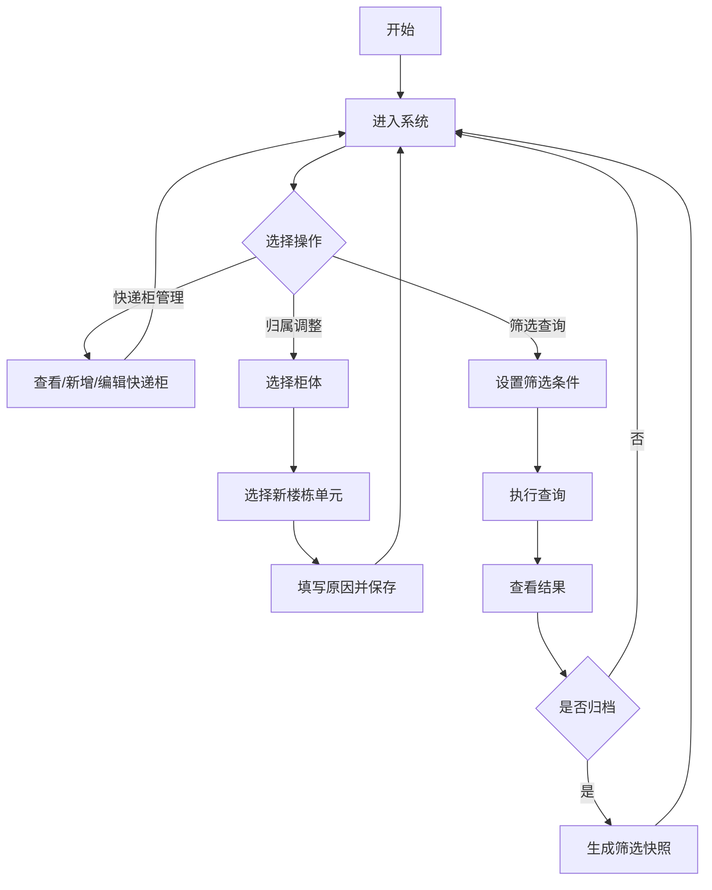

## 1. Product Overview
居民小区快递柜楼栋单元多条件组合筛选归档系统，为小区物业提供快递寄存柜的统一管理平台，支持多条件组合筛选及筛选结果批量归档留存。

- **主要用途**：管理园区内所有快递柜档案，实现楼栋单元绑定、归属调整、多维度筛选查询及筛选快照归档
- **目标用户**：小区物业管理人员
- **市场价值**：提升快递柜管理效率，实现档案数字化管理，便于园区规划调整后的追溯查询

## 2. Core Features

### 2.1 User Roles
| Role | Registration Method | Core Permissions |
|------|---------------------|------------------|
| 物业管理员 | 系统内部账号 | 快递柜档案管理、楼栋单元绑定、筛选查询、归档操作 |

### 2.2 Feature Module
1. **快递柜管理**：基础档案录入、查看、编辑、删除
2. **楼栋单元管理**：树形结构展示、绑定关系管理
3. **归属调整记录**：变更柜体所属区域，留存历史记录
4. **多条件筛选**：楼栋、单元、柜体规格、录入时间段组合查询
5. **筛选快照归档**：将筛选结果生成独立归档记录，长期留存

### 2.3 Page Details
| Page Name | Module Name | Feature description |
|-----------|-------------|---------------------|
| 首页 | 统计概览 | 展示快递柜总数、楼栋分布、近期调整记录 |
| 快递柜列表 | 档案管理 | 展示所有快递柜档案，支持搜索和基础筛选 |
| 快递柜详情 | 档案详情 | 展示单个快递柜完整信息及归属变更历史 |
| 快递柜编辑 | 档案编辑 | 新增或编辑快递柜基础信息 |
| 筛选查询 | 多条件筛选 | 楼栋、单元、柜体规格、时间段自由组合查询 |
| 归档管理 | 快照管理 | 查看、管理筛选快照归档记录 |

## 3. Core Process

### 3.1 快递柜录入流程
1. 管理员进入快递柜编辑页面
2. 填写柜体编号、格口数量、安装位置等基础信息
3. 选择所属楼栋和单元
4. 提交保存

### 3.2 归属调整流程
1. 管理员在快递柜详情页点击调整归属
2. 选择新的楼栋和单元
3. 填写调整原因
4. 提交并留存记录

### 3.3 多条件筛选流程
1. 管理员进入筛选查询页面
2. 设置筛选条件（楼栋、单元、柜体规格、录入时间段）
3. 点击查询，展示筛选结果
4. 可将结果保存为归档快照

### 3.4 流程图

## 4. User Interface Design

### 4.1 Design Style
- **主色调**：深蓝色系（#1e3a5f），传达专业、稳重的管理系统形象
- **辅助色**：青色（#00bcd4）用于强调和交互元素
- **按钮样式**：圆角矩形，主按钮渐变效果，悬停时微动画
- **字体**：Inter 字体，清晰易读
- **布局风格**：侧边栏导航 + 卡片式内容布局
- **图标风格**：简洁线性图标

### 4.2 Page Design Overview
| Page Name | Module Name | UI Elements |
|-----------|-------------|-------------|
| 首页 | 统计卡片 | 数字统计、趋势图表、快捷入口 |
| 快递柜列表 | 表格展示 | 分页表格、操作按钮、搜索框 |
| 快递柜详情 | 信息面板 | 标签页切换、归属历史时间线 |
| 筛选查询 | 筛选表单 | 下拉选择、日期范围、联动条件 |
| 归档管理 | 快照列表 | 卡片网格、快照时间、筛选条件摘要 |

### 4.3 Responsiveness
- 桌面优先设计，支持 1280px+ 分辨率
- 侧边栏可折叠，适应不同屏幕宽度
- 表格在小屏幕下自动横向滚动

### 4.4 交互细节
- 树形选择器支持懒加载子节点
- 筛选条件联动：选择楼栋后自动过滤单元选项
- 归档保存时显示加载动画
- 操作成功后显示 Toast 提示
