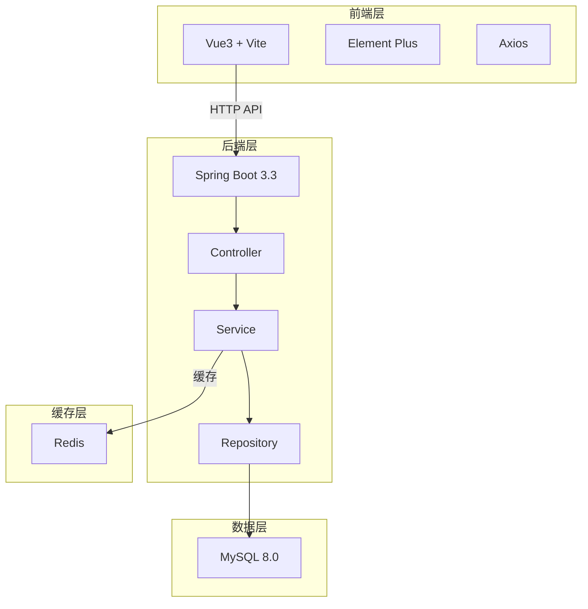
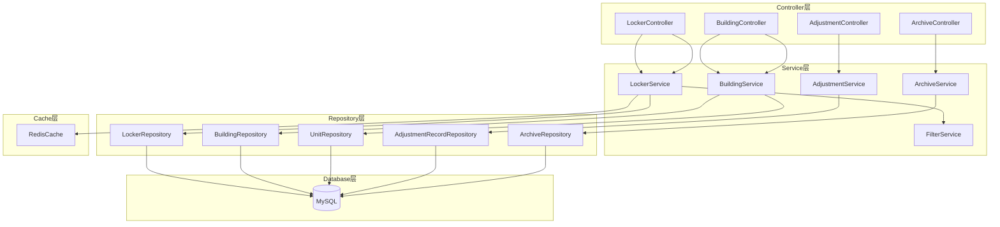
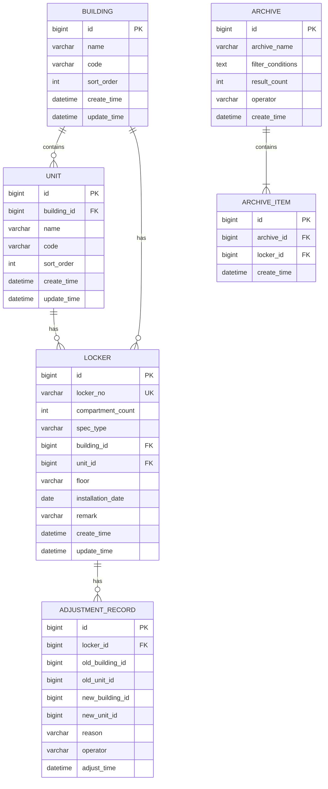

## 1. Architecture Design



## 2. Technology Description
- **Frontend**: Vue3 + TypeScript + Vite
- **UI Framework**: Element Plus
- **HTTP Client**: Axios
- **Backend**: Spring Boot 3.3 + JDK 17 + Maven
- **Database**: MySQL 8.0
- **Caching**: Redis
- **Containerization**: Docker + Docker Compose

## 3. Route Definitions

| Route | Purpose | Component |
|-------|---------|-----------|
| / | 首页统计概览 | Dashboard |
| /lockers | 快递柜列表 | LockerList |
| /lockers/:id | 快递柜详情 | LockerDetail |
| /lockers/create | 新增快递柜 | LockerForm |
| /lockers/:id/edit | 编辑快递柜 | LockerForm |
| /filter | 多条件筛选 | FilterSearch |
| /archives | 归档管理 | ArchiveList |

## 4. API Definitions

### 4.1 快递柜相关
| Method | Endpoint | Description |
|--------|----------|-------------|
| GET | /api/lockers | 获取快递柜列表（支持分页和筛选） |
| GET | /api/lockers/{id} | 获取单个快递柜详情 |
| POST | /api/lockers | 新增快递柜 |
| PUT | /api/lockers/{id} | 更新快递柜信息 |
| DELETE | /api/lockers/{id} | 删除快递柜 |

### 4.2 楼栋单元相关
| Method | Endpoint | Description |
|--------|----------|-------------|
| GET | /api/buildings | 获取楼栋树形结构 |
| GET | /api/buildings/{id}/units | 获取楼栋下的单元列表 |
| POST | /api/buildings | 新增楼栋 |
| POST | /api/units | 新增单元 |

### 4.3 归属调整相关
| Method | Endpoint | Description |
|--------|----------|-------------|
| GET | /api/lockers/{id}/adjustments | 获取快递柜归属调整记录 |
| POST | /api/lockers/{id}/adjust | 执行归属调整 |

### 4.4 筛选归档相关
| Method | Endpoint | Description |
|--------|----------|-------------|
| POST | /api/lockers/filter | 多条件筛选查询 |
| POST | /api/archives | 保存筛选快照归档 |
| GET | /api/archives | 获取归档列表 |
| GET | /api/archives/{id} | 获取归档详情 |
| DELETE | /api/archives/{id} | 删除归档 |

### 4.5 请求/响应示例

#### 新增快递柜
**Request**:
```json
{
  "lockerNo": "LC001",
  "compartmentCount": 48,
  "specType": "STANDARD",
  "buildingId": 1,
  "unitId": 1,
  "floor": "1F",
  "installationDate": "2024-01-15",
  "remark": "主入口旁"
}
```

**Response**:
```json
{
  "id": 1,
  "lockerNo": "LC001",
  "compartmentCount": 48,
  "specType": "STANDARD",
  "buildingName": "1号楼",
  "unitName": "1单元",
  "floor": "1F",
  "installationDate": "2024-01-15",
  "remark": "主入口旁",
  "createTime": "2024-01-15T10:00:00"
}
```

#### 多条件筛选
**Request**:
```json
{
  "buildingIds": [1, 2],
  "unitIds": [1],
  "specTypes": ["STANDARD", "LARGE"],
  "startDate": "2024-01-01",
  "endDate": "2024-12-31",
  "page": 1,
  "size": 20
}
```

**Response**:
```json
{
  "data": [...],
  "total": 100,
  "page": 1,
  "size": 20
}
```

#### 保存归档
**Request**:
```json
{
  "archiveName": "2024年度1号楼快递柜统计",
  "filterConditions": {...},
  "resultCount": 50
}
```

## 5. Server Architecture Diagram



## 6. Data Model

### 6.1 ER Diagram



### 6.2 DDL Statements

```sql
CREATE TABLE building (
    id BIGINT AUTO_INCREMENT PRIMARY KEY,
    name VARCHAR(100) NOT NULL COMMENT '楼栋名称',
    code VARCHAR(50) UNIQUE COMMENT '楼栋编码',
    sort_order INT DEFAULT 0 COMMENT '排序',
    create_time DATETIME DEFAULT CURRENT_TIMESTAMP,
    update_time DATETIME DEFAULT CURRENT_TIMESTAMP ON UPDATE CURRENT_TIMESTAMP
) ENGINE=InnoDB DEFAULT CHARSET=utf8mb4 COMMENT='楼栋表';

CREATE TABLE unit (
    id BIGINT AUTO_INCREMENT PRIMARY KEY,
    building_id BIGINT NOT NULL COMMENT '楼栋ID',
    name VARCHAR(100) NOT NULL COMMENT '单元名称',
    code VARCHAR(50) COMMENT '单元编码',
    sort_order INT DEFAULT 0 COMMENT '排序',
    create_time DATETIME DEFAULT CURRENT_TIMESTAMP,
    update_time DATETIME DEFAULT CURRENT_TIMESTAMP ON UPDATE CURRENT_TIMESTAMP,
    FOREIGN KEY (building_id) REFERENCES building(id) ON DELETE CASCADE
) ENGINE=InnoDB DEFAULT CHARSET=utf8mb4 COMMENT='单元表';

CREATE TABLE locker (
    id BIGINT AUTO_INCREMENT PRIMARY KEY,
    locker_no VARCHAR(50) UNIQUE NOT NULL COMMENT '柜体编号',
    compartment_count INT NOT NULL COMMENT '格口数量',
    spec_type VARCHAR(20) NOT NULL COMMENT '柜体规格',
    building_id BIGINT NOT NULL COMMENT '所属楼栋',
    unit_id BIGINT NOT NULL COMMENT '所属单元',
    floor VARCHAR(20) COMMENT '楼层',
    installation_date DATE COMMENT '安装日期',
    remark TEXT COMMENT '备注',
    create_time DATETIME DEFAULT CURRENT_TIMESTAMP,
    update_time DATETIME DEFAULT CURRENT_TIMESTAMP ON UPDATE CURRENT_TIMESTAMP,
    FOREIGN KEY (building_id) REFERENCES building(id),
    FOREIGN KEY (unit_id) REFERENCES unit(id)
) ENGINE=InnoDB DEFAULT CHARSET=utf8mb4 COMMENT='快递柜表';

CREATE TABLE adjustment_record (
    id BIGINT AUTO_INCREMENT PRIMARY KEY,
    locker_id BIGINT NOT NULL COMMENT '快递柜ID',
    old_building_id BIGINT COMMENT '原楼栋ID',
    old_unit_id BIGINT COMMENT '原单元ID',
    new_building_id BIGINT NOT NULL COMMENT '新楼栋ID',
    new_unit_id BIGINT NOT NULL COMMENT '新单元ID',
    reason TEXT COMMENT '调整原因',
    operator VARCHAR(50) COMMENT '操作人',
    adjust_time DATETIME DEFAULT CURRENT_TIMESTAMP COMMENT '调整时间',
    FOREIGN KEY (locker_id) REFERENCES locker(id)
) ENGINE=InnoDB DEFAULT CHARSET=utf8mb4 COMMENT='归属调整记录表';

CREATE TABLE archive (
    id BIGINT AUTO_INCREMENT PRIMARY KEY,
    archive_name VARCHAR(200) NOT NULL COMMENT '归档名称',
    filter_conditions TEXT COMMENT '筛选条件JSON',
    result_count INT NOT NULL COMMENT '结果数量',
    operator VARCHAR(50) COMMENT '操作人',
    create_time DATETIME DEFAULT CURRENT_TIMESTAMP COMMENT '创建时间'
) ENGINE=InnoDB DEFAULT CHARSET=utf8mb4 COMMENT='筛选快照归档表';

CREATE TABLE archive_item (
    id BIGINT AUTO_INCREMENT PRIMARY KEY,
    archive_id BIGINT NOT NULL COMMENT '归档ID',
    locker_id BIGINT NOT NULL COMMENT '快递柜ID',
    create_time DATETIME DEFAULT CURRENT_TIMESTAMP,
    FOREIGN KEY (archive_id) REFERENCES archive(id) ON DELETE CASCADE,
    FOREIGN KEY (locker_id) REFERENCES locker(id)
) ENGINE=InnoDB DEFAULT CHARSET=utf8mb4 COMMENT='归档明细表';
```

### 6.3 初始数据

```sql
INSERT INTO building (name, code, sort_order) VALUES 
('1号楼', 'B001', 1),
('2号楼', 'B002', 2),
('3号楼', 'B003', 3);

INSERT INTO unit (building_id, name, code, sort_order) VALUES 
(1, '1单元', 'U001', 1),
(1, '2单元', 'U002', 2),
(2, '1单元', 'U003', 1),
(2, '2单元', 'U004', 2),
(3, '1单元', 'U005', 1);
```

## 7. 缓存设计

### 7.1 Redis 缓存策略

| 缓存 Key | 数据类型 | 过期时间 | 说明 |
|----------|----------|----------|------|
| locker:spec_types | String | 30天 | 柜体规格分类模板 |
| building:tree | String | 1小时 | 楼栋单元树形结构 |
| building:{id} | String | 1小时 | 单个楼栋信息 |
| unit:{buildingId} | String | 1小时 | 楼栋下单元列表 |

### 7.2 缓存更新策略
- 楼栋/单元数据变更时主动更新缓存
- 规格分类模板为静态配置，定期刷新
- 查询优先读取缓存，缓存不存在时查询数据库并写入缓存
